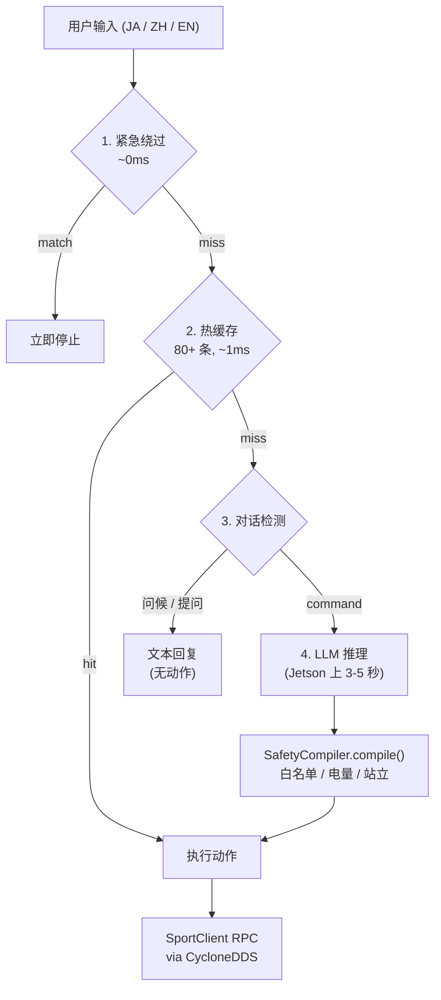

<p align="center">
  <a href="README.md">English</a> ·
  <a href="README.ja.md">日本語</a> ·
  <strong>中文</strong>
</p>

<p align="center">
  
  <br>
  <sub>图片来源: <a href="https://www.unitree.com/go2">Unitree Robotics</a></sub>
</p>

# Claudia — LLM 大脑机器人智能

[](https://www.python.org/)
[](https://developer.nvidia.com/embedded/jetson-orin)
[](https://www.unitree.com/)
[](https://huggingface.co/Qwen/Qwen2.5-7B)
[](https://github.com/psf/black)
[](LICENSE)

**Claudia** 是面向 **Unitree Go2** 四足机器人的 LLM 大脑 AI 系统。它通过本地 LLM 推理（Ollama 上的 Qwen2.5-7B），将日语、中文和英语的自然语言命令转化为机器人动作。完全在 NVIDIA Jetson Orin NX 上本地运行。

> *"LLM 就是机器人的大脑"* —— 语义理解，而非关键词匹配。

---

<details>
<summary><strong>目录</strong></summary>

- [演示](#演示)
- [核心特性](#核心特性)
- [快速开始](#快速开始)
- [使用示例](#使用示例)
- [支持的动作](#支持的动作)
- [架构](#架构)
- [语音识别 (ASR)](#语音识别-asr)
- [技术栈](#技术栈)
- [开发](#开发)
- [故障排除](#故障排除)
- [路线图](#路线图)
- [致谢](#致谢)
- [许可证](#许可证)

</details>

## 演示

### Claudia 语音流水线

[](https://youtu.be/O6TpC9Se3Ds)

> 语音 → ASR → 本地 LLM → 机器人执行 —— 完全本地推理，无需云端。
> 演示命令：站 / 座 / 趴（日语语音输入，Unitree Go2 实机）

### Claudia 终端控制

[](https://youtu.be/gdyy1p4hkY4)

> 交互式启动器 → 键盘模式 → 日语文本命令 → 机器人执行。
> 演示命令：站 (立って) / 座 (座って) / 趴 (伏せて) / 打招呼 (挨拶して)（文本输入，Unitree Go2 实机）

### Claudia 高级动作

[](https://youtu.be/-Sj_ffcLJzA)

> 高危模式切换 (c) → 拉伸 / 前跳 / 前空翻 — 演示 SafetyCompiler 门控机制。
> 此处使用终端模式演示 — 语音与终端共享同一 LLM 管线，仅输入方式不同。

<details>
<summary><strong>Go2 动作预览</strong> —— Unitree 官方素材（点击展开）</summary>
<br>
<p align="center">
  <a href="https://youtu.be/8gaULsglOQE"></a>
  <a href="https://youtu.be/DXRojz4N8K8"></a>
  <a href="https://youtu.be/8ReuPIKcydw"></a>
</p>
<p align="center">
  <a href="https://youtu.be/F1JtFksc_k0"></a>
  <a href="https://youtu.be/rjVfRanqUC4"></a>
</p>

| 视频 | 链接 |
|------|------|
| 舞蹈表演 | [YouTube](https://youtu.be/8gaULsglOQE) |
| 前空翻 | [YouTube](https://youtu.be/DXRojz4N8K8) |
| 高速奔跑 | [YouTube](https://youtu.be/8ReuPIKcydw) |
| 障碍回避 | [YouTube](https://youtu.be/F1JtFksc_k0) |
| 4D LiDAR 建图 | [YouTube](https://youtu.be/rjVfRanqUC4) |
| 性能总览 | [YouTube](https://youtu.be/N6burwXML70) |
| 续航测试 | [YouTube](https://youtu.be/klw6Hvu4EzI) |
| 手机 APP 控制 | [YouTube](https://youtu.be/IM2MKeuHtu4) |

<sub>全部影像来自 <a href="https://www.unitree.com/go2">Unitree Robotics 官网</a>，仅用于教育/研究演示目的。</sub>
</details>

---

## 核心特性

### LLM 大脑架构
- **语义理解**：将抽象概念映射到机器人动作（例如："可愛い"（可爱）→ 比心手势，"疲れた"（累了）→ 坐下）
- **直接 API 输出**：LLM 输出带动作码的结构化 JSON —— 无需中间映射层
- **单一真源**：全部 27 个动作定义集中在 `action_registry.py`；白名单、站立需求、方法映射等下游集合自动派生
- **确定性推理**：`temperature=0.0` 的 JSON 模式确保行为一致

### 安全系统 (SafetyCompiler)
- **统一安全管线**：所有动作路径都经过 `SafetyCompiler.compile()` —— 无法绕过
- **三级电量门控**：<=10%：仅安全动作 | <=20%：禁止高能耗 | <=30%：翻转降级为舞蹈
- **站立前置条件**：需要时自动前插 StandUp（例如：Hello 需要站立状态）
- **虚拟姿态追踪**：在动作序列内追踪姿态变化，确保前置条件插入正确
- **白名单强制**：只有已注册、已启用的动作才能执行

### 硬件控制
- **18 个验证动作**：8 个基础姿态 + 7 个表演 + 3 个高级（参见[支持的动作](#支持的动作)）
- **实时控制**：1ms（缓存命中）到约 5 秒（Jetson 上 LLM 推理）的响应时间
- **状态感知序列**：自动解决动作依赖关系
- **优雅降级**：真实硬件 → 模拟仿真，带结构化错误码

### 多语言交互
- **日语优先**：针对日语对话优化（热缓存、响应验证、ASR）
- **多语言就绪架构**：Qwen2.5-7B 原生理解日语、中文和英语
- **ASR 语言切换**：Whisper 语言参数可按会话配置
- **ASR 假名正规化**：内置 KANA_ALIASES 管线，清理语音识别输出

---

## 快速开始

### 环境要求

| 组件 | 要求 |
|:---:|---|
| 机器人 | Unitree Go2（推荐 R&D Plus 版本） |
| 计算平台 | NVIDIA Jetson Orin NX |
| 操作系统 | Ubuntu 20.04 (aarch64) |
| Python | 3.8 以上 |
| LLM 运行时 | [Ollama](https://ollama.ai/) |
| 中间件 | ROS2 Foxy + CycloneDDS |
| 网络 | 以太网连接机器人 (`192.168.123.x`) |

### 安装

```bash
git clone https://github.com/ShunmeiCho/Claudia.git
cd claudia
pip install -e .

# 安装 Ollama（如尚未安装）
curl -fsSL https://ollama.ai/install.sh | sh

# 创建 Claudia 大脑模型
ollama create claudia-7b:v2.0 -f models/ClaudiaIntelligent_7B_v2.0

# 环境配置
export RMW_IMPLEMENTATION=rmw_cyclonedds_cpp
export PYTHONPATH=/path/to/unitree_sdk2_python:$PYTHONPATH
```

### 启动

```bash
# 交互式启动器（推荐）
./start_production_brain.sh
```

启动器会显示模式选择菜单：

```
==================================
🤖 Claudia Production Brain Launcher
==================================

🔧 網路配置:
   本機IP: 192.168.123.18
   機器人IP: 192.168.123.161 (Go2)
   DDS配置: eth0
   Python: /usr/bin/python3 (Python 3.8.10)

运行モード選択:
  1) キーボード + シミュレーション
  2) キーボード + 実機
  3) 語音 + シミュレーション
  4) 語音 + 実機
  c) 設定パネル
  t) 後台モード (tmux)
```

| 选项 | 模式 | 说明 |
|:---:|------|------|
| **1** | 键盘 + 模拟 | 在 REPL 中输入命令，动作仅记录不发送至机器人。用于开发和测试 |
| **2** | 键盘 + 实机 | 输入命令，通过 DDS 发送至真实 Go2 执行。会提示确认连接 |
| **3** | 语音 + 模拟 | USB 麦克风 → ASR → LLM 管线，动作模拟执行。用于语音管线调试 |
| **4** | 语音 + 实机 | 完整管线：语音输入 → ASR → LLM → SafetyCompiler → 真实机器人执行 |
| **c** | 配置面板 | 启动前调整各项设置（见下方） |
| **t** | 后台模式 (tmux) | 在 tmux 会话中启动，SSH 断连后仍保持运行 |

#### 配置面板

选项 `c` 打开设置面板，可在启动前配置运行参数：

| 设置项 | 默认值 | 说明 |
|--------|--------|------|
| 唤醒词 | OFF | 启用/禁用"クラちゃん"唤醒词门控 |
| 启动动画 | OFF | 启动时执行 RecoveryStand + Hello 动作 |
| LLM 模型 | `claudia-7b:v2.0` | 从已安装的 Ollama 模型中选择 |
| 路由模式 | `dual` | `dual`（Action 通道）/ `legacy`（仅 7B）/ `shadow`（A/B 对比） |
| ASR 模型 | `base` | `base`（~2-3 秒）/ `small`（~5-8 秒）/ `medium`（~10-15 秒） |
| 高风险动作 | OFF | 允许 FrontFlip、FrontJump、FrontPounce |
| 麦克风设备 | `auto` | 自动检测 USB 麦克风，或手动指定（如 `hw:2,0`） |

#### 直接启动（跳过菜单）

```bash
./start_production_brain.sh --voice          # 语音 + 模拟
./start_production_brain.sh --voice-hw       # 语音 + 实机

# 直接运行 Python 脚本：
python3 production_commander.py              # 键盘 + 模拟
python3 production_commander.py --hardware   # 键盘 + 实机
python3 voice_commander.py                   # 语音 + 模拟
python3 voice_commander.py --hardware        # 语音 + 实机
python3 voice_commander.py --asr-mock        # 语音 + 模拟 ASR（无需麦克风）
python3 voice_commander.py --daemon          # 后台模式（tmux 用）
```

---

## 使用示例

```
Claudia> こんにちは          → 挥手打招呼 (1016)
Claudia> 座って              → 坐下 (1009)
Claudia> 可愛いね            → 比心手势 (1036) — 语义理解："可爱" 触发爱意表达
Claudia> 立ってから挨拶して  → 序列：StandUp(1004) → Hello(1016)
Claudia> 疲れた              → 坐下 (1009) — 语义理解："累了" 触发休息
Claudia> dance               → 随机 Dance1(1022) 或 Dance2(1023)
Claudia> 量子力学について教えて → 对话回复（无动作）
```

---

## 支持的动作

### 基础姿态（8 个动作）

| API 码 | 方法名 | 日语 | 中文 | 英语 | 需站立 |
|:-:|--------|--------|---------|---------|:-:|
| 1001 | Damp | ダンプモード | 阻尼模式 | Damp | - |
| 1002 | BalanceStand | バランス | 平衡站立 | Balance | - |
| 1003 | StopMove | 止まる | 停止 | Stop | - |
| 1004 | StandUp | 立つ | 站立 | Stand Up | - |
| 1005 | StandDown | 伏せる | 趴下 | Stand Down | Yes |
| 1006 | RecoveryStand | 回復 | 恢复站立 | Recovery | - |
| 1009 | Sit | 座る | 坐下 | Sit | Yes |
| 1010 | RiseSit | 起き上がる | 起立 | Rise Sit | - |

### 表演动作（7 个动作）

| API 码 | 方法名 | 日语 | 中文 | 英语 | 需站立 |
|:-:|--------|--------|---------|---------|:-:|
| 1016 | Hello | 挨拶 | 打招呼 | Hello | Yes |
| 1017 | Stretch | 伸び | 伸懒腰 | Stretch | Yes |
| 1022 | Dance1 | ダンス1 | 舞蹈1 | Dance 1 | Yes |
| 1023 | Dance2 | ダンス2 | 舞蹈2 | Dance 2 | Yes |
| 1029 | Scrape | 刮る | 刮擦 | Scrape | Yes |
| 1033 | WiggleHips | 腰振り | 摇臀 | Wiggle Hips | Yes |
| 1036 | Heart | ハート | 比心 | Heart | Yes |

### 高级 / 高风险（3 个动作）

| API 码 | 方法名 | 日语 | 中文 | 英语 | 风险 |
|:-:|--------|--------|---------|---------|------|
| 1030 | FrontFlip | 前転 | 前空翻 | Front Flip | 高 |
| 1031 | FrontJump | ジャンプ | 前跳 | Front Jump | 高 |
| 1032 | FrontPounce | 飛びかかる | 前扑 | Front Pounce | 高 |

> 高风险动作受电量门控约束，且需要站立状态。默认禁用（`allow_high_risk=False`）。

---

## 架构

### 硬件平台

<p align="center">
  
  <br>
  <sub>图片来源: <a href="https://www.unitree.com/go2">Unitree Robotics</a></sub>
</p>

Claudia 运行在 **Unitree Go2** 四足机器人上，外接 **NVIDIA Jetson Orin NX** 作为 AI 计算模块：

| 组件 | 规格 |
|------|------|
| **机器人** | Unitree Go2（12 自由度、8000mAh 电池、4D LiDAR L2） |
| **AI 模块** | NVIDIA Jetson Orin NX 16GB（Developer Kit） |
| **GPU** | 1024 核 NVIDIA Ampere，612MHz max，CUDA 11.4 |
| **CPU** | 8 核 Arm Cortex-A78AE（aarch64） |
| **内存 / 存储** | 16GB LPDDR5 / 512GB NVMe SSD |
| **操作系统** | Ubuntu 20.04，L4T R35.3.1（JetPack 5.1.1），Python 3.8.10 |
| **LLM 运行时** | Ollama + Qwen2.5-7B（Q4_K_M，VRAM ~4.7GB） |
| **ASR** | faster-whisper base（CPU int8，~1.6 秒/句） |
| **麦克风** | Audio-Technica AT2020USB-XP（44.1kHz → 16kHz 重采样） |
| **网络** | 以太网（eth0，192.168.123.x）用于机器人 DDS 通信 |

### 命令处理管线



> **路由模式** (`BRAIN_ROUTER_MODE`): `dual`（默认，Action 专用模型，~30 tokens）| `legacy`（7B 完整响应）| `shadow`（A/B 对比日志）

<details>
<summary><strong>模块概览</strong>（点击展开）</summary>

| 模块 | 职责 |
|--------|------|
| `brain/production_brain.py` | 核心管线：缓存→路由→安全→执行 |
| `brain/channel_router.py` | 双通道 LLM 路由器（legacy/dual/shadow 模式） |
| `brain/action_registry.py` | 所有动作定义的单一真源 |
| `brain/safety_compiler.py` | 统一安全管线（电量、站立、白名单） |
| `brain/audit_logger.py` | 结构化审计日志 (`logs/audit/`) |
| `brain/mock_sport_client.py` | 测试用 SportClient 模拟器 |
| `robot_controller/system_state_monitor.py` | 基于 ROS2 的电量/姿态监控（5Hz） |
| `robot_controller/unified_led_controller.py` | LED 模式 API（思考中/成功/错误/监听） |
| `production_commander.py` | 键盘 REPL 入口 |
| `voice_commander.py` | 语音模式入口：ASR + AudioCapture + ASRBridge |
| `audio/asr_service/` | ASR 服务器：faster-whisper + silero-vad + UDS |

</details>

---

## 语音识别 (ASR)

> 状态：**Phase 2 已上线** —— 完整语音管线已在 Jetson 上通过 USB 麦克风运行。

### 语音管线

```
USB 麦克风 (AT2020USB-XP, 自动检测声卡, 44100Hz)
  │ arecord 子进程 → 重采样 → 16kHz 960byte 帧
  v
AudioCapture ──→ /tmp/claudia_audio.sock ──→ ASR Server（子进程）
                                                ├── silero-vad + 紧急检测
                                                ├── faster-whisper base (ja, beam=1, CPU int8)
                                                v
ASRBridge ←── /tmp/claudia_asr_result.sock ←─── JSON Lines
  ├── emergency → 队列清空 + 冷却 → brain 调用（绕过锁）
  ├── transcript → 置信度 ≥0.35 过滤 → 去重 → Queue(3)
  └── command worker → brain.process_and_execute(text)
```

### 进程守护

- **SIGHUP 处理**：两个命令器均忽略 SIGHUP —— SSH 断连不会杀死进程
- **ASR 自动重启**：ASR 子进程崩溃时，VoiceCommander 自动重启完整管线（Bridge → Capture → ASR → 重建）。最多重试 3 次，超限后进入降级模式（仅键盘）
- **tmux 集成**：`start_production_brain.sh` 选项 `t` 在 tmux 会话中启动，完整转发环境变量，抗 SSH 断连
- **Ollama GPU 清理**：退出时通过 `keep_alive=0` 立即释放 GPU 显存，避免模型空占 30 分钟

### ASR 环境变量

| 变量 | 默认值 | 选项 |
|------|--------|------|
| `CLAUDIA_ASR_MODEL` | `base` | `base` / `small` / `medium` |
| `CLAUDIA_ASR_BEAM_SIZE` | `1`（贪心解码） | `1` / `3`+（束搜索） |
| `CLAUDIA_ASR_DEVICE` | `cpu` | `cpu` / `cuda` |
| `CLAUDIA_WAKE_WORD_ENABLED` | `0`（关闭） | `0` / `1` |
| `CLAUDIA_WAKE_WORD_TIMEOUT` | `5`（秒） | 独立唤醒词后的监听窗口 |

### 假名正规化

- **KANA_ALIASES 管线**：已集成到热缓存层。将常见的 ASR 假名输出正规化为汉字（例如：`おすわり` → `お座り`、`おて` → `お手`、`はーと` → `ハート`）。消除了日语语音命令中 ASR 不匹配的首要原因。
- **日语后缀剥离**：敬语后缀（です/ます/ください）在热缓存匹配时自动剥离（例如：`かわいいです` → `かわいい`）。
- **紧急命令假名变体**：`EMERGENCY_COMMANDS` 字典包含纯假名变体（`とまれ`、`とめて`、`ていし`），确保即使 ASR 转写不完美也能可靠执行紧急停止。

---

## 文本转语音 (TTS)

> 状态：**回声门控已实现** —— ASR 服务器已实现回声门控。TTS Provider 集成计划在 PR3 完成（VOICEVOX / Google TTS）。

回复目前在 REPL 中以文本形式显示。机器人用日语回复（由 `_sanitize_response()` 验证）。大脑**绝不**触碰 TTS —— `ProductionBrain` 仅产出文本 + 动作码，TTS 播放完全由命令器层管理。

---

## 技术栈

| 组件 | 技术 |
|:---:|---|
| LLM | Qwen2.5-7B via [Ollama](https://ollama.ai/) |
| 机器人 | Unitree Go2 + unitree_sdk2_python |
| 通信 | CycloneDDS + ROS2 Foxy |
| 平台 | NVIDIA Jetson Orin NX (aarch64) |
| 语言 | Python 3.8.10 |
| 操作系统 | Ubuntu 20.04 |
| GPU | CUDA 11.4 |

---

## 开发

### 安装（开发模式）

```bash
pip install -e ".[dev]"    # 包含 pytest, black, flake8, mypy
```

### 测试

```bash
python3 test/run_tests.py                    # 全部测试
python3 test/run_tests.py --type unit        # 仅单元测试
python3 test/run_tests.py --type hardware    # 仅硬件测试
pytest test/ -v                               # 通过 pytest
```

### 代码检查/格式化

```bash
black --line-length 88 src/
flake8 src/
mypy src/
```

---

## 故障排除

| 问题 | 原因 | 解决方案 |
|------|------|---------|
| 错误 3103 | Unitree APP 占用 sport mode | 关闭 APP 并重启机器人 |
| DDS 连接失败 | 网络配置错误 | 确认 `eth0` 的 IP 为 `192.168.123.x`，检查 `RMW_IMPLEMENTATION` |
| LLM 超时 | 模型未加载 | 运行 `ollama list`，检查 `curl localhost:11434/api/tags` |
| 导入错误 | 缺少 PYTHONPATH | `export PYTHONPATH=/path/to/unitree_sdk2_python:$PYTHONPATH` |
| 错误 3104 | RPC 超时（异步动作） | 机器人可能仍在执行中，请检查连通性 |
| Action 通道 10 秒超时 | Jetson GPU 冷启动 | 空闲后首条命令正常现象；模型会自动预热 |
| `(聴取中)` 但无识别 | 麦克风静音/增益过低 | 检查麦克风增益，测试：`arecord -D hw:X,0 -d 3 /tmp/t.raw` |
| ASR 慢（>5 秒/句） | CPU 上使用 whisper-small | 使用 base（默认）：`CLAUDIA_ASR_MODEL=base` |

---

## 路线图

| 阶段 | 内容 | 状态 |
|:---:|---|:---:|
| PR1 | SafetyCompiler + action_registry + P0 安全修复 | 完成 |
| PR2 | 双通道 LLM 路由（动作+语音分离） | 完成 |
| PR3 | ASR/TTS 集成 | ASR 完成，TTS 待实现 |
| P2 | 参数化动作（Move, Euler, SpeedLevel） | 计划中 |
| P2 | 3B 动作通道 A/B 测试 | 计划中 |

---

## 致谢

Claudia 基于以下开源项目构建：

- [Qwen2.5](https://github.com/QwenLM/Qwen2.5) — 驱动机器人大脑的多语言 LLM
- [Ollama](https://ollama.ai/) — 本地 LLM 推理运行时
- [Unitree SDK2](https://github.com/unitreerobotics) — Go2 机器人控制 SDK
- [faster-whisper](https://github.com/SYSTRAN/faster-whisper) — 基于 CTranslate2 的 ASR 引擎
- [silero-vad](https://github.com/snakers4/silero-vad) — 语音活动检测
- [ROS 2 Foxy](https://docs.ros.org/en/foxy/) + [CycloneDDS](https://cyclonedds.io/) — 机器人中间件

---

## 许可证

MIT License — 详见 [LICENSE](LICENSE)。
