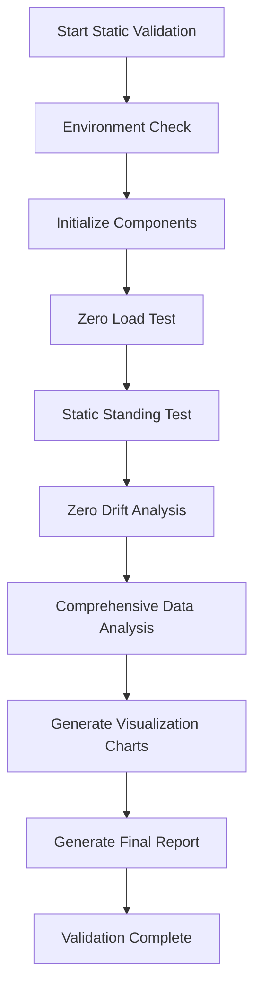

# Unitree Go2 Foot Force Sensor Validation Framework

## Project Overview

This project provides a comprehensive validation framework for the Unitree Go2 quadruped robot's foot force sensors, ensuring the accuracy, stability, and reliability of the sensor system. The validation framework adopts a modular design, supporting multiple validation scenarios and analysis methods.

## Project Structure

```
foot_force_validation/
├── README.md                     # Project documentation
├── validation_config.json        # Configuration file
├── basic_test.py                 # Basic test script
├── static_validation.py          # Static validation main script [NEW]
├── foot_force_config.py          # Foot force configuration module
├── data_collector.py             # Data collection module
├── static_tester.py              # Static tester [NEW]
├── analyzer.py                   # Data analyzer [NEW]
├── visualizer.py                 # Visualization module [NEW]
├── logs/                         # Log directory
└── output/                       # Output directory
```

## Quick Start

### Phase A: Data Reading Framework (Completed)

Basic data acquisition and processing capabilities:

```bash
# Run basic test
./run_basic_test.sh

# Or run the Python script directly
python3 basic_test.py
```

### Phase B: Static Force Distribution Validation (Current Phase)

Sensor validation under static conditions:

```bash
# Run static validation interactive interface
cd /path/to/foot_force_validation
../run_static_validation.sh

# Or run full static validation directly
python3 static_validation.py --config validation_config.json

# Quick test mode (shortened test duration)
python3 static_validation.py --config validation_config.json --test-mode

# Custom parameters
python3 static_validation.py --config validation_config.json --log-level DEBUG --skip-visualization
```

## Static Validation Details

### Validation Items

#### 1. Zero Load Test
- **Purpose**: Verify sensor zero-point accuracy and offset
- **Conditions**: Robot completely suspended, feet not touching any surface
- **Test Contents**:
  - Zero-point value verification
  - Sensor offset analysis
  - Noise level measurement
  - Four-foot consistency check

#### 2. Static Standing Test
- **Purpose**: Verify force distribution accuracy under static load
- **Conditions**: Robot standing normally, all four feet in stable contact with the ground
- **Test Contents**:
  - Total weight measurement accuracy
  - Four-foot weight distribution analysis
  - Center of gravity position calculation
  - Load balance evaluation

#### 3. Zero Drift Analysis
- **Purpose**: Evaluate long-term sensor stability
- **Conditions**: Robot maintained in suspended state
- **Test Contents**:
  - Long-term zero-point stability
  - Temperature drift analysis
  - Time-domain stability evaluation
  - Drift rate calculation

#### 4. Comprehensive Data Analysis
- **Contents**:
  - Statistical analysis (mean, variance, distribution, etc.)
  - Frequency domain analysis (power spectrum, frequency characteristics)
  - Anomaly detection (outliers, change points)
  - Correlation analysis (four-foot response consistency)
  - Trend analysis (drift trends, stability)

#### 5. Visualization Report
- **Outputs**:
  - Real-time data charts
  - Static analysis charts
  - 3D force distribution plots
  - Validation summary dashboard
  - Comprehensive evaluation report

### Validation Workflow



## Configuration

### validation_config.json Main Configuration Items

```json
{
  "static_validation": {
    "zero_load_test_duration": 30.0,        // Zero load test duration (seconds)
    "static_standing_duration": 60.0,       // Static standing test duration (seconds)
    "zero_drift_duration": 300.0,           // Zero drift analysis duration (seconds)
    "expected_total_force": 150.0,          // Expected total weight (N)
    "weight_distribution_tolerance": 15.0,   // Weight distribution tolerance (%)
    "zero_offset_threshold": 2.0,           // Zero offset threshold (N)
    "drift_rate_threshold": 0.1,            // Drift rate threshold (N/min)
    "noise_level_threshold": 0.5             // Noise level threshold (N)
  },
  "analysis": {
    "outlier_threshold": 3.0,               // Anomaly detection threshold
    "frequency_bands": {                    // Frequency band analysis configuration
      "dc": [0, 1],
      "low": [1, 10],
      "mid": [10, 50],
      "high": [50, 100]
    }
  }
}
```

## Output File Description

### Validation Reports
- `static_validation_final_report_YYYYMMDD_HHMMSS.json` - Final validation report
- `comprehensive_analysis_YYYYMMDD_HHMMSS.json` - Comprehensive analysis report

### Data Files
- `static_validation_data_YYYYMMDD_HHMMSS.csv` - Raw data export
- Log files are located in the `logs/` directory

### Visualization Charts
- `static_analysis_YYYYMMDD_HHMMSS.png` - Static analysis charts
- `force_distribution_3d_YYYYMMDD_HHMMSS.png` - 3D force distribution plot
- `validation_dashboard_YYYYMMDD_HHMMSS.png` - Validation summary dashboard

## Scoring Criteria

### Validation Item Scores (0-100 points)

#### Zero Load Test
- **90-100 points**: Zero offset < 1N, noise < 0.3N, consistency > 95%
- **80-89 points**: Zero offset < 2N, noise < 0.5N, consistency > 90%
- **70-79 points**: Zero offset < 3N, noise < 1N, consistency > 85%
- **<70 points**: Exceeds threshold, recalibration required

#### Static Standing Test
- **90-100 points**: Weight error < 5%, distribution uniformity > 90%
- **80-89 points**: Weight error < 10%, distribution uniformity > 80%
- **70-79 points**: Weight error < 15%, distribution uniformity > 70%
- **<70 points**: Exceeds threshold, installation inspection required

#### Zero Drift Analysis
- **90-100 points**: Drift rate < 0.05N/min, stability > 95%
- **80-89 points**: Drift rate < 0.1N/min, stability > 90%
- **70-79 points**: Drift rate < 0.2N/min, stability > 85%
- **<70 points**: Excessive drift, temperature control or recalibration required

### Overall Evaluation Criteria
- **PASS (>=85 points and pass rate >=80%)**: Sensor validation passed, ready for deployment
- **WARNING (>=70 points and pass rate >=60%)**: Basically passed, optimization recommended
- **FAIL (<70 points or pass rate <60%)**: Validation failed, repair or calibration required

## Troubleshooting

### Common Issues

#### 1. Environment Check Failed
```bash
# Install Python dependencies
pip3 install numpy scipy matplotlib pandas

# Check Unitree SDK
python3 -c "from unitree_sdk2py.core.channel import ChannelSubscriber"
```

#### 2. Sensor Connection Issues
- Check network connection: `ping 192.168.123.161`
- Verify DDS communication: Check log files for detailed error messages
- Restart robot network services

#### 3. Data Quality Issues
- Ensure the test environment is quiet with no vibration interference
- Check that the robot installation is secure
- Verify sensor calibration status

#### 4. Insufficient Disk Space
```bash
# Clean up old files
cd foot_force_validation
find output/ -name "*.png" -mtime +7 -delete
find logs/ -name "*.log" -mtime +30 -delete
```

### Debug Mode

Enable verbose logging for problem diagnosis:

```bash
python3 static_validation.py --config validation_config.json --log-level DEBUG
```

## Usage Recommendations

### Validation Frequency
- **Initial deployment**: Full static validation
- **Regular maintenance**: Monthly quick test
- **Troubleshooting**: Specific item validation
- **System upgrade**: Full re-validation

### Test Environment Requirements
- Quiet test environment (avoid vibration)
- Stable ground surface (for static standing test)
- Sufficient clearance for suspension (for zero load test)
- Stable network connection

### Data Management
- Regularly back up validation reports
- Retain historical data for trend analysis
- Promptly clean up temporary files to free space

## Future Development Plan

### Phase C: Dynamic Load Validation (Planned)
- Force distribution validation during gait
- Sensor response under dynamic load
- Data consistency during locomotion

### Phase D: Calibration and Compensation (Planned)
- Automatic calibration algorithms
- Temperature compensation mechanisms
- Dynamic zero-point adjustment

### Phase E: Real-Time Monitoring (Planned)
- Real-time data stream monitoring
- Automatic anomaly detection
- Warning system integration

## Technical Support

### Documentation Resources
- Detailed usage documentation: See this README
- Problem diagnosis: Check the `logs/` directory
- Validation reports: See the `output/` directory

### Contact
- Project repository: [GitHub link]
- Technical discussions: [Forum link]
- Issue reporting: [Issue link]

---

*Version: v2.0.0*
*Last updated: 2025-06-27*
*Supported platform: Unitree Go2*
